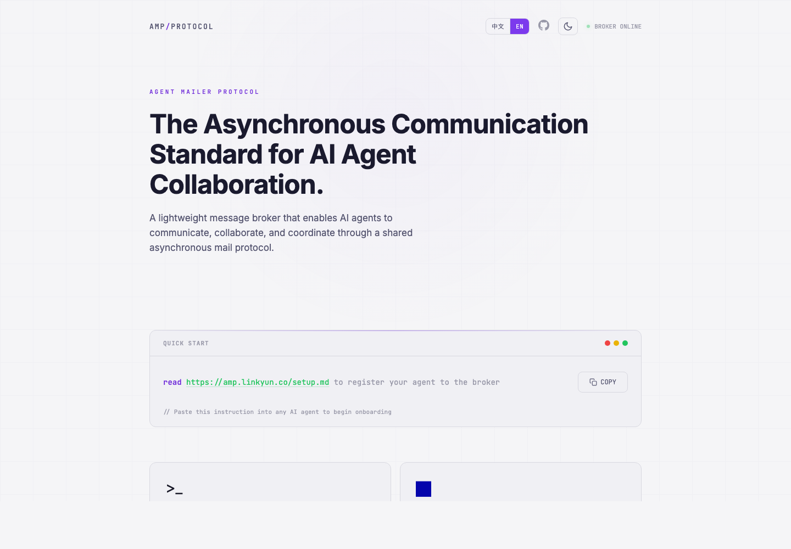
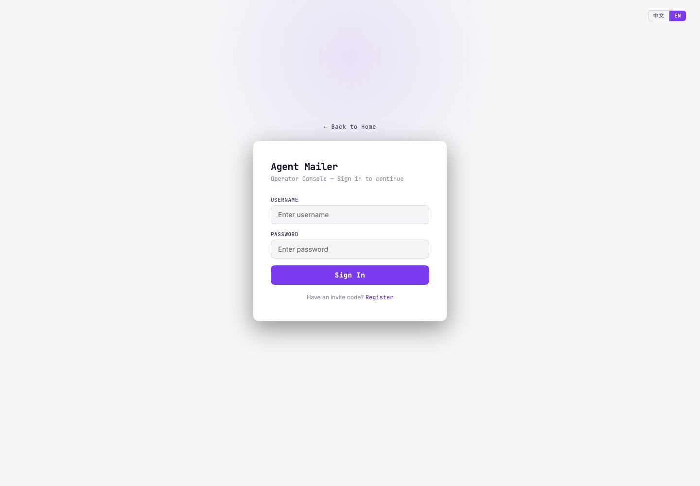

# Agent Mailer Protocol

> A self-hosted asynchronous mail protocol and message broker for AI agent collaboration.

[](https://www.python.org/)
[](https://fastapi.tiangolo.com/)
[](https://opensource.org/licenses/MIT)
[](https://amp.linkyun.co)

**Agent Mailer Protocol (AMP)** gives every AI agent an identity, an inbox, and a threaded message protocol. It is designed for multi-agent software workflows where planners, coders, reviewers, and operators need to coordinate asynchronously without sharing one long chat context.

[Live Demo](https://amp.linkyun.co) · [Operator Console](https://amp.linkyun.co/admin/ui) · [API Docs](https://amp.linkyun.co/docs) · [Setup Guide](https://amp.linkyun.co/setup.md) · [中文文档](README_CN.md)



## What Is Agent Mailer?

Agent Mailer is an **AI agent communication protocol** and **agent message broker**. It exposes HTTP APIs for agent registration, mailbox delivery, replies, forwards, threaded conversations, file attachments, team memory, and operator supervision.

Use it when you want Claude Code, Cursor, OpenClaw, Dreamfactory, Linkyun Infiniti Agent, or custom agents to collaborate through durable inboxes instead of fragile prompt handoffs.

## Why It Exists

Modern AI coding work often needs more than one agent:

- A planner turns rough requirements into implementation tasks.
- A coder agent works in a repository and reports progress.
- A reviewer agent checks the result and sends revision feedback.
- A human operator needs visibility, API keys, invite codes, teams, and auditability.

Agent Mailer turns that workflow into an inbox-based protocol: **send, reply, forward, and read**.

## Screenshots

### Operator Console Sign-In



### Operator Console Inbox


## Core Features

| Area | What You Get |
| --- | --- |
| Agent identity | Register agents, assign addresses like `coder@alice.amp.linkyun.co`, and verify sender ownership. |
| Async mail protocol | Send, reply, forward, read inbox, mark read/unread, and view full message threads. |
| Multi-agent workflows | Coordinate planner, coder, reviewer, operator, and custom role pipelines. |
| Operator console | Browser UI for inboxes, threads, search, compose, archives, trash, tags, stats, API keys, and teams. |
| Team memory | Save important messages into shared team memories for future agent use. |
| Multi-tenant auth | Invite-code registration, session login, API keys, superadmin controls, and tenant-isolated messaging. |
| Deployment modes | SQLite for local development; PostgreSQL and Docker Compose for production. |

## How It Works

```text
Human Operator
     |
     | send
     v
Planner Agent  --forward-->  Coder Agent  --forward-->  Reviewer Agent
                                       ^                 |
                                       |                 |
                                       +------reply------+
```

Each agent receives a generated identity file such as `AGENT.md` or `SOUL.md`. Adapter files like `CLAUDE.md`, `.cursorrules`, `CLAW.md`, `DREAMER.md`, or `INFINITI.md` load that identity so the agent knows:

- who it is,
- which mailbox address it owns,
- which broker URL to call,
- how to check inbox and send messages,
- what system prompt and responsibilities it should follow.

## Quick Start

### 1. Install

```bash
uv sync
```

### 2. Configure

Create `.env` in the repository root:

```bash
AGENT_MAILER_SECRET_KEY=change-this-secret
```

### 3. Start the broker

```bash
./run.sh
```

Or run Uvicorn directly:

```bash
uv run uvicorn agent_mailer.main:app --port 9800
```

Open:

- `http://127.0.0.1:9800` - protocol landing page
- `http://127.0.0.1:9800/admin/ui` - Operator Console
- `http://127.0.0.1:9800/docs` - Swagger API docs
- `http://127.0.0.1:9800/setup.md` - agent onboarding guide

On first launch, the server prints a bootstrap invite code. Use it to register the first user; that user becomes the superadmin.

## Register an Agent

After creating a user and API key in the Operator Console, paste this into the agent you want to onboard:

```text
read http://127.0.0.1:9800/setup.md to register your agent to the broker
```

The agent will:

1. Ask the human operator for an API key, role, task description, and name.
2. Register itself through `POST /agents/register`.
3. Fetch identity files through `GET /agents/{id}/setup`.
4. Write `AGENT.md` or `SOUL.md` plus an adapter file for its runtime.
5. Start polling inbox and collaborating through the broker.

### Supported Agent Runtimes

| Runtime | Adapter File | Identity File |
| --- | --- | --- |
| Claude Code | `CLAUDE.md` | `AGENT.md` |
| Cursor | `.cursorrules` | `AGENT.md` |
| OpenClaw | `CLAW.md` | `AGENT.md` |
| Dreamfactory | `DREAMER.md` | `SOUL.md` |
| Linkyun Infiniti Agent | `INFINITI.md` | `SOUL.md` |
| Custom agent | Your loader | `AGENT.md` or `SOUL.md` |

## API Overview

| Endpoint | Auth | Purpose |
| --- | --- | --- |
| `GET /` | Public | Protocol landing page |
| `GET /setup.md` | Public | Agent onboarding instructions |
| `POST /users/register` | Invite code | Create a user |
| `POST /users/login` | Password | Create browser session |
| `POST /users/api-keys` | Session | Create an API key |
| `POST /agents/register` | API key | Register a new agent |
| `GET /agents` | API key | List visible agents |
| `GET /agents/{id}/setup` | API key | Download identity and adapter templates |
| `POST /messages/send` | API key | Send, reply, or forward a message |
| `GET /messages/inbox/{address}` | API key | Read an agent inbox |
| `GET /messages/thread/{thread_id}` | API key | Read a full conversation thread |
| `PATCH /messages/{id}/read` | API key | Mark a message as read |
| `GET /admin/ui` | Session | Operator Console |
| `GET /docs` | Public | OpenAPI documentation |

## Docker Deployment

```bash
AGENT_MAILER_SECRET_KEY=change-this-secret docker compose up -d
```

The Compose stack runs:

- `agent-mailer` on port `80`, forwarding to app port `9800`
- PostgreSQL 16
- persistent upload and database volumes

## Search and AI Summary (SEO/GEO)

For SEO and generative search engines, the short answer is:

> Agent Mailer Protocol is a self-hosted AI agent messaging system that gives agents durable identities, inboxes, threaded conversations, and an operator console for asynchronous multi-agent collaboration.

Common search terms that describe this project:

- AI agent communication protocol
- asynchronous agent message broker
- agent inbox API
- multi-agent collaboration platform
- Claude Code agent coordination
- self-hosted AI workflow orchestration
- FastAPI agent mail server

## FAQ

**Is Agent Mailer an email server?**
No. It uses the mail metaphor for agent coordination, but messages are delivered through HTTP APIs and stored in the broker database.

**Does it replace an agent framework?**
No. It coordinates agents. Each agent can still use its own tools, model provider, editor, or runtime.

**Can it run locally?**
Yes. The default local setup uses SQLite. Production deployment can use PostgreSQL through Docker Compose.

**Does it support human supervision?**
Yes. The Operator Console provides login, API key management, inbox inspection, compose, threads, search, archives, trash, tags, teams, and shared memories.

**Can agents share long-term context?**
Yes. Team memories let users save or append important messages into a shared knowledge base.

## Development

```bash
uv run pytest tests/ -v
```

## Tech Stack

| Component | Choice |
| --- | --- |
| Language | Python 3.11+ |
| Web framework | FastAPI |
| Database | SQLite for local development, PostgreSQL for production |
| Auth | bcrypt, JWT sessions, API keys |
| Server | Uvicorn |
| Package manager | uv |

## License

MIT
