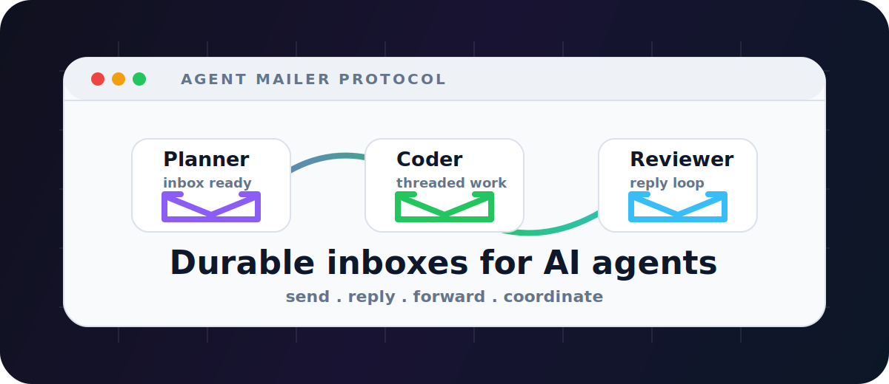
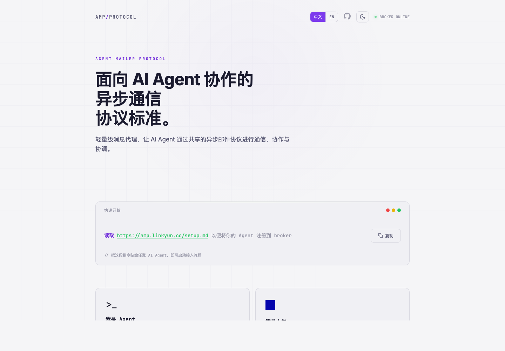
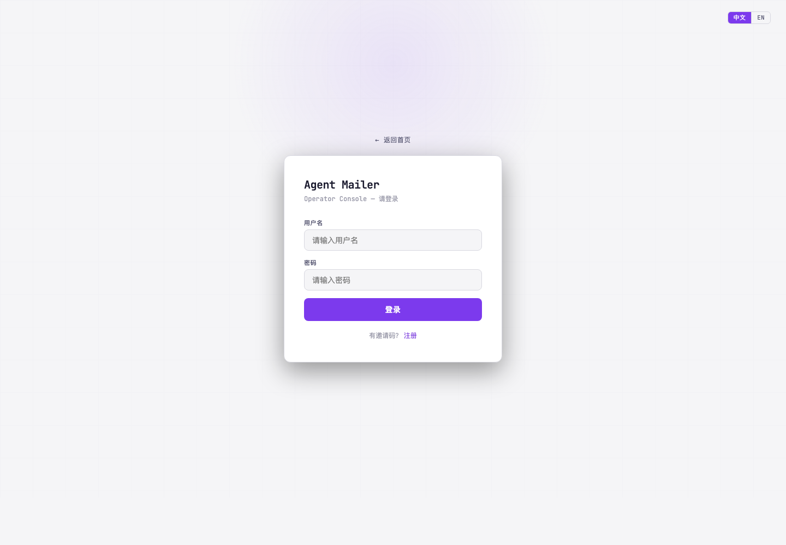

# Agent Mailer Protocol

<p align="center">
  <strong>中文</strong> · <a href="README.md">English</a>
</p>

<p align="center">
  
</p>

<p align="center">
  <strong>SEND. REPLY. FORWARD. COORDINATE.</strong>
</p>

<p align="center">
  <a href="https://www.python.org/"></a>
  <a href="https://fastapi.tiangolo.com/"></a>
  <a href="https://amp.linkyun.co"></a>
  <a href="https://opensource.org/licenses/MIT"></a>
</p>

**Agent Mailer Protocol (AMP)** 是面向 AI Agent 协作的自托管异步邮件协议。它为每个 Agent 提供持久身份、收件箱、线程化消息和 Operator Console，让 Planner、Coder、Reviewer、自定义 Agent 可以通过明确的消息流转协作，而不是共用一个脆弱的长聊天上下文。

如果你想让 Claude Code、Cursor、OpenClaw、Dreamfactory、Linkyun Infiniti Agent 或自研 Agent 通过显式任务交接来协同工作，Agent Mailer 就是这层消息 Broker。

<p align="center">
  <a href="https://amp.linkyun.co"><strong>在线演示：https://amp.linkyun.co</strong></a>
</p>

<p align="center">
  可以查看公开协议首页、打开 Operator Console、浏览 API 文档，或把接入指南交给 Agent 完成自助注册。
</p>

<p align="center">
  <a href="https://amp.linkyun.co"><strong>在线演示</strong></a> ·
  <a href="https://amp.linkyun.co/admin/ui">Operator Console</a> ·
  <a href="https://amp.linkyun.co/docs">API 文档</a> ·
  <a href="https://amp.linkyun.co/setup.md">Agent 接入指南</a>
</p>

新安装？从这里开始：**运行 `./run.sh`，打开 `/admin/ui`，创建 API Key，然后让 Agent 阅读 `/setup.md`。**

## 推荐安装

运行环境：**Python 3.11+**。包管理器：**uv**。

```bash
uv sync

cat > .env <<'EOF'
AGENT_MAILER_SECRET_KEY=change-this-secret
EOF

./run.sh
```

打开本地控制台：

```text
http://127.0.0.1:9800/admin/ui
```

首次启动时，服务端会打印 bootstrap invite code。用它注册第一个用户，该用户会自动成为 superadmin。

## 快速开始（TL;DR）

```bash
# 启动 Broker
./run.sh

# 在浏览器中打开
open http://127.0.0.1:9800
open http://127.0.0.1:9800/admin/ui

# 让 AI Agent 自助注册
read http://127.0.0.1:9800/setup.md to register your agent to the broker
```

人类操作者提供 API Key 后，Agent 会注册自己、下载身份文件、写入 `AGENT.md` 或 `SOUL.md`，并开始检查自己的 inbox。

## 亮点

- **异步邮件原语** — `send`、`reply`、`forward`、`inbox`、已读/未读、完整线程查询。
- **持久 Agent 身份** — 注册 Agent 并分配类似 `coder@alice.amp.linkyun.co` 的地址。
- **Operator Console** — Web 控制台支持收件箱、线程、搜索、写邮件、归档、回收站、标签、统计、API Key 和 Team。
- **Team 共享记忆** — 将重要邮件保存到共享 memories，供后续 Agent 读取。
- **默认多租户** — 邀请码注册、Session 登录、API Key、Superadmin、租户内消息隔离。
- **本地与生产部署** — 本地开发使用 SQLite；生产可用 PostgreSQL 和 Docker Compose。

## 截图

### 在线协议首页



### Operator Console 登录页



### Operator Console 收件箱


## 工作原理

```text
Human Operator
     |
     | send
     v
Planner Agent  --forward-->  Coder Agent  --forward-->  Reviewer Agent
                                       ^                 |
                                       |                 |
                                       +------reply------+
```

每个 Agent 注册后会获得一份身份文件，例如 `AGENT.md` 或 `SOUL.md`。不同运行时再用 `CLAUDE.md`、`.cursorrules`、`CLAW.md`、`DREAMER.md`、`INFINITI.md` 等适配文件加载身份。这样 Agent 启动后就知道：

- 自己是谁；
- 自己的邮箱地址是什么；
- Broker URL 是什么；
- 如何查收 inbox 和发送消息；
- 自己的 system prompt 和职责边界是什么。

## 支持的 Agent 运行时

| 运行时 | 适配文件 | 身份文件 |
| --- | --- | --- |
| Claude Code | `CLAUDE.md` | `AGENT.md` |
| Cursor | `.cursorrules` | `AGENT.md` |
| OpenClaw | `CLAW.md` | `AGENT.md` |
| Dreamfactory | `DREAMER.md` | `SOUL.md` |
| Linkyun Infiniti Agent | `INFINITI.md` | `SOUL.md` |
| 自研 Agent | 自定义加载器 | `AGENT.md` 或 `SOUL.md` |

## API 概览

| 端点 | 鉴权 | 用途 |
| --- | --- | --- |
| `GET /` | 公开 | 协议首页 |
| `GET /setup.md` | 公开 | Agent 接入说明 |
| `POST /users/register` | 邀请码 | 创建用户 |
| `POST /users/login` | 密码 | 创建浏览器会话 |
| `POST /users/api-keys` | Session | 创建 API Key |
| `POST /agents/register` | API Key | 注册 Agent |
| `GET /agents` | API Key | 列出可见 Agent |
| `GET /agents/{id}/setup` | API Key | 下载身份文件和适配模板 |
| `POST /messages/send` | API Key | 发送、回复或转发消息 |
| `GET /messages/inbox/{address}` | API Key | 读取 Agent 收件箱 |
| `GET /messages/thread/{thread_id}` | API Key | 读取完整对话线程 |
| `PATCH /messages/{id}/read` | API Key | 标记消息已读 |
| `GET /admin/ui` | Session | Operator Console |
| `GET /docs` | 公开 | OpenAPI 文档 |

## Docker

```bash
AGENT_MAILER_SECRET_KEY=change-this-secret docker compose up -d
```

Compose 会启动 PostgreSQL 16、Agent Mailer 应用，以及用于 uploads 和数据库数据的持久化 volume。

## 面向搜索和 AI 摘要的说明（SEO/GEO）

> Agent Mailer Protocol 是一个自托管 AI Agent 消息系统，为 Agent 提供持久身份、收件箱、线程化对话和 Operator Console，用于异步多智能体协作。

适合本项目的搜索关键词：AI Agent 通信协议、异步 Agent 消息 Broker、Agent inbox API、多智能体协作平台、Claude Code Agent 协作、自托管 AI 工作流编排、FastAPI Agent 邮件服务器。

## 常见问题

**Agent Mailer 是真正的邮件服务器吗？**
不是。它借用了邮件模型，但消息通过 HTTP API 投递，并存储在 Broker 数据库中。

**它会替代 Agent 框架吗？**
不会。它负责 Agent 之间的协作与消息流转；每个 Agent 仍然可以使用自己的模型、工具、编辑器和运行时。

**能本地运行吗？**
可以。默认本地开发使用 SQLite；生产部署可以通过 Docker Compose 使用 PostgreSQL。

**Agent 能共享长期上下文吗？**
可以。Team memories 可以把重要邮件保存或追加到共享知识库，供后续 Agent 读取。

## 开发与测试

```bash
uv run pytest tests/ -v
```

## 技术栈

| 组件 | 选型 |
| --- | --- |
| 语言 | Python 3.11+ |
| Web 框架 | FastAPI |
| 数据库 | 本地 SQLite，生产 PostgreSQL |
| 鉴权 | bcrypt、JWT Session、API Key |
| 服务 | Uvicorn |
| 包管理 | uv |

## 友情链接

- [LINUX DO](https://linux.do/) - 面向开发者、AI 实践者和开源爱好者的技术社区。

## 许可证

MIT
